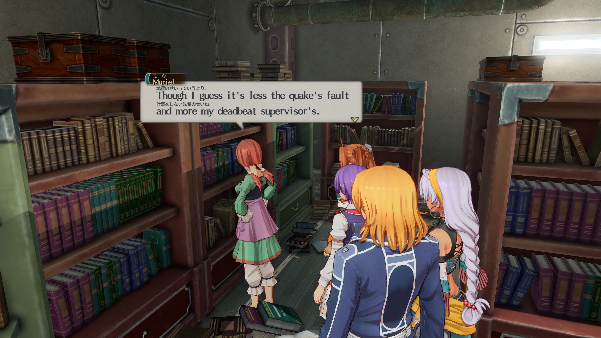

# Sora Bilingual — Trails in the Sky the 2nd bilingual mod

[简体中文](README.md) · **English** · [日本語](README.ja.md)

Display two languages together in the PC game, or hold a shortcut to switch temporarily. Supports Japanese, English, Simplified and Traditional Chinese, Korean, French, German and Spanish.

## Install

1. Download the stable `windows-x64-setup.exe` from [GitHub Releases](https://github.com/Llugaes/bilingual-sora-2nd/releases/latest) or [Gitee](https://gitee.com/Llugaes/bilingual-sora-2nd/releases) and install it.
2. Open **Bilingual Sora 2nd**, choose an interface language, then launch the game. Game discovery, text-language detection, fonts and mapping preparation are automatic. The first preparation may take several minutes.
3. Choose a secondary language under **Language & display**. The primary follows the game automatically. If the game switches to your secondary, the two swap; otherwise your secondary stays unchanged. The languages must differ.

Windows 10/11 x64; no administrator rights or separate Python installation required. The installer works offline and upgrades preserve settings. For the portable edition, extract and run `BilingualSora2nd.exe`. First game-language detection sets the initial secondary. Your secondary preference is then preserved, except when a language collision requires a swap. Game language settings, original PACs and EXE are unchanged.

Enable **Experimental**, off by default, to choose a primary manually. This experimental feature may introduce instability, unpredictable behavior and bugs. To experience another primary language, we recommend changing the language in the game. Turn it off to follow the game again.

## Use

**Recommended: single-language mode → hold for secondary.** Hold to compare, release to return. Bilingual mode shows both together. Adjust size, spacing, color and opacity under **Text layout**.

| Action | Default shortcut |
|---|---|
| Show / hide interface | Ctrl + Shift + F9 |
| Language switch for the current mode | Ctrl + Shift + F10 |

Under **Quick actions**, select an action and record a keyboard or controller combination. Controller names are detected automatically or selected as PlayStation, Xbox or Switch; changing names preserves the binding.

Click the compact window or gear to open settings; hold and drag to move it. **—** and the settings **×** hide to tray; right-click the tray to exit completely. Text, symbols and color distinguish building, connecting, ready, disabled and error states. **Appearance** provides three themes, Chinese/English/Japanese interface languages and background opacity.

Additional glyphs are prepared from current local resources in an external cache and loaded into memory on connection. Startup, game exit and reconnection never automatically write to the game directory. Preparation, verification, loading and errors are reported separately. Historical explicit font installations remain separate; this default does not imply DLL-free operation.

## Limits and compatibility

- Bilingual dialogue logs can still hitch when opened and reduce frame rate. Single-language hold mode can reduce the burden.
- Uncertain matches retain original text. Text in images or videos is excluded. Fixed game text boxes may crowd long text; reduce size or use single-language mode.
- New combinations still require mapping work. Valid language-local parsing and identity caches are reused; zero waiting is not guaranteed.
- Accepted 0.4.2 samples include original Steam build 25386012 / EXE 1.03.2 and the EXE bundled with full-voice MOD 1.0.7. The latter tested only the replacement EXE, not the complete voice resources. Other modified EXEs, the full game and all language combinations have not been individually tested.

## Updates and help

Automatic checks only notify. Download, install and rollback require manual confirmation; exit the game before updating. Gitee is preferred for downloads in China; GitHub retains full portable packages and older releases. Roll back with an older complete package, preserve settings and optionally disable update checks.

For connection failures, read status details and retry; for font failures, check font status. Windowed/borderless mode works best for the tool interface. Report tool/game versions, game text language, primary/secondary languages and a short error excerpt. Do not upload complete game resources, caches or saves.

Development: [Contributing](CONTRIBUTING.md), [Architecture](docs/ARCHITECTURE.md), [Debugging](docs/DEBUGGING.md), [Verification](docs/verification/README.md). Local candidates require explicit in-game user acceptance before public release.

## License and thanks

Code: [MIT](LICENSE). Dependency and adapted-code notices: [THIRD_PARTY.md](THIRD_PARTY.md). Thanks to the maintainers of 0xDC00/scripts, Tom, FPACker, Ingert, sora2looseload, Frida, Qt/PySide6, pygame-ce/SDL, pefile, LZ4, Inno Setup and its Chinese translation.

Unofficial tool; game, trademarks and artwork belong to their owners. Releases exclude game archives, generated game fonts, complete text indexes and user settings.
