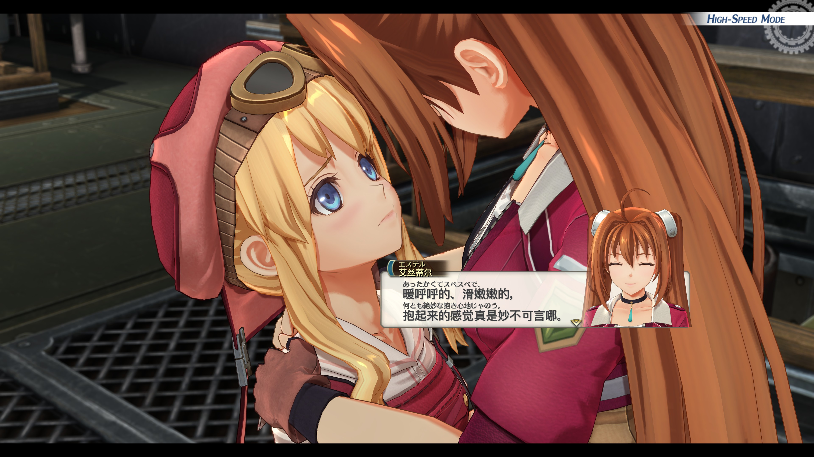

# Sora Bilingual — 空之轨迹 the 2nd 双语 Mod

**简体中文** · [English](README.en.md) · [日本語](README.ja.md)

在 PC 版游戏中同时显示两种语言，或按住快捷键临时切换。支持简中、繁中、日、英、韩、法、德、西班牙文。

## 安装

1. 从 [Gitee](https://gitee.com/Llugaes/bilingual-sora-2nd/releases) 或 [GitHub Releases](https://github.com/Llugaes/bilingual-sora-2nd/releases/latest) 下载稳定版 `windows-x64-setup.exe` 并安装。
2. 打开 **Bilingual Sora 2nd**，首次选择界面语言，再启动游戏。工具自动寻找游戏、检测文字语言并准备字体和映射；首次可能需要数分钟。
3. 在“语言与显示”选择副语言。主语言默认自动跟随游戏；两者不能相同。游戏切到当前副语言时自动对调，切到其他语言时保留副语言。

Windows 10/11 x64，无需管理员权限或另装 Python。安装包支持离线安装，升级保留设置。便携版解压后运行 `BilingualSora2nd.exe`。首次识别游戏语言时设置副语言默认值；之后保留副语言偏好，遇到与游戏语言相同才对调。不修改游戏语言设置、原始 PAC 或 EXE。

只有打开默认关闭的 **Experimental** 才能手动调整主语言。该功能属于实验性质，可能引入较多不稳定性、不确定性及 bug；如需体验其他主语言，建议直接在游戏内设置语言。关闭后恢复跟随游戏。

## 使用

**日常推荐单语言模式 → 按住显示副语言**：按住对照，松开恢复。双语模式可同屏显示；字号、间距、颜色和透明度在“文字排版”调整。

| 操作 | 默认快捷键 |
|---|---|
| 展开／隐藏界面 | Ctrl + Shift + F9 |
| 当前模式的语言切换 | Ctrl + Shift + F10 |

在“快捷操作”选择操作后录制键盘或手柄组合。手柄名称自动识别，也可手选 PlayStation、Xbox 或 Switch；名称选择不改变绑定。

点击小窗口或齿轮打开设置，按住拖动。“—”及设置窗口“×”隐藏到托盘；右键托盘“退出工具”完全退出。小窗口用文字、符号和颜色区分构建、连接、就绪、停用和异常。“工具外观”可切换三种主题、中文／英文／日文界面和背景透明度。

跨语言字库自动从当前本机资源准备外置缓存，连接后加载到内存；启动、退出、重连均不自动写游戏目录。准备、校验、加载和异常分别显示。历史显式字体安装仍单独管理；默认零写入不等于 DLL-free。

## 已知限制与兼容性

- 双语对话日志仍可能出现开页停顿和帧率下降；单语言按住切换可减轻负担。
- 未确认的配对保留原文；图片、视频内文字不处理。固定文本框可能容不下长文本，可减小字号或改用单语言。
- 新组合仍需构建映射；有效的单语言解析与身份缓存会复用，不能保证零等待。
- 0.4.2 实机样本包括原版 Steam build 25386012 / EXE 1.03.2，以及 full-voice MOD 1.0.7 附带 EXE。后者只验收了替换 EXE，未验收完整语音资源包；其他修改版、全游戏及全部语言组合未逐一验证。

## 更新与排障

自动检查只提示新版本；下载、安装和回退均需手动确认。更新前退出游戏。国内下载优先 Gitee；GitHub 提供完整便携包与历史版本。回退使用旧版完整包并保留设置，可关闭自动检查。

连接失败时查看状态详情并重试；字体异常查看字体状态。窗口化／无边框模式更适合显示工具界面。报告问题请附工具与游戏版本、游戏文字语言、主副语言及精简错误信息，勿上传完整资源、缓存或存档。

开发见 [贡献指南](CONTRIBUTING.md)、[架构](docs/ARCHITECTURE.md)、[诊断约定](docs/DEBUGGING.md) 和 [验证记录](docs/verification/README.md)。本地候选须通过用户实机验收才可公开发布。

## 许可与致谢

代码采用 [MIT](LICENSE)，依赖和衍生代码声明见 [THIRD_PARTY.md](THIRD_PARTY.md)。感谢 0xDC00/scripts、Tom、FPACker、Ingert、sora2looseload、Frida、Qt/PySide6、pygame-ce/SDL、pefile、LZ4 和 Inno Setup 及其中文翻译的维护者。

这是非官方工具；游戏、商标与美术资源属于其权利人。发行包不含游戏资源包、生成字库、完整文本索引或用户配置。
