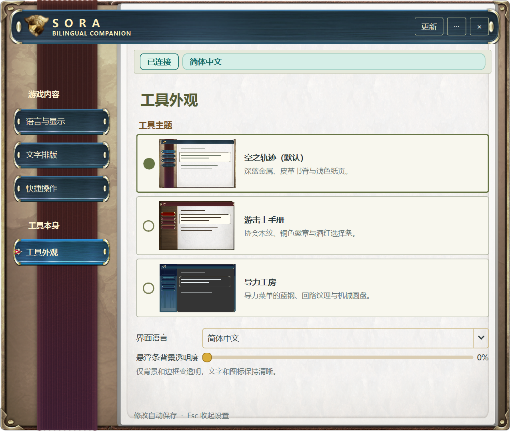
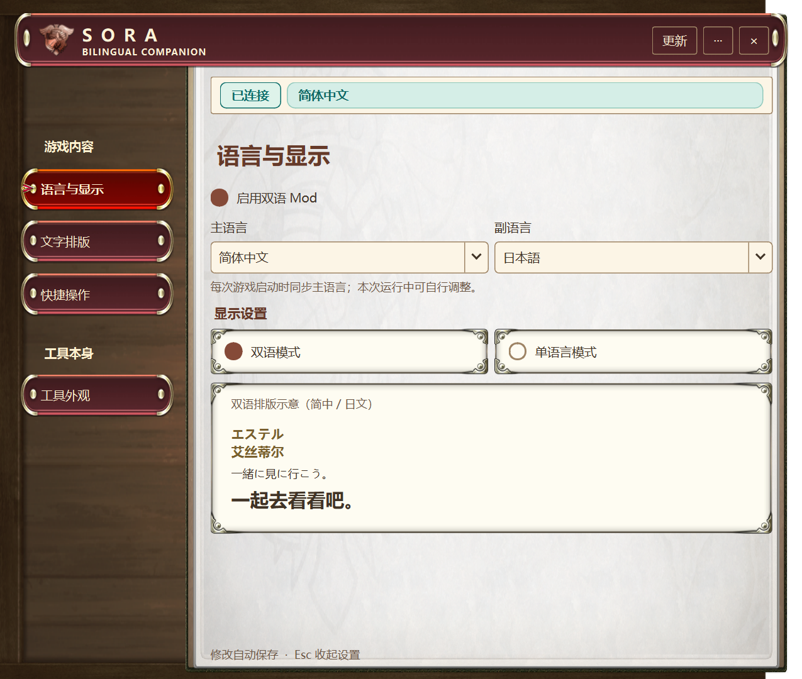
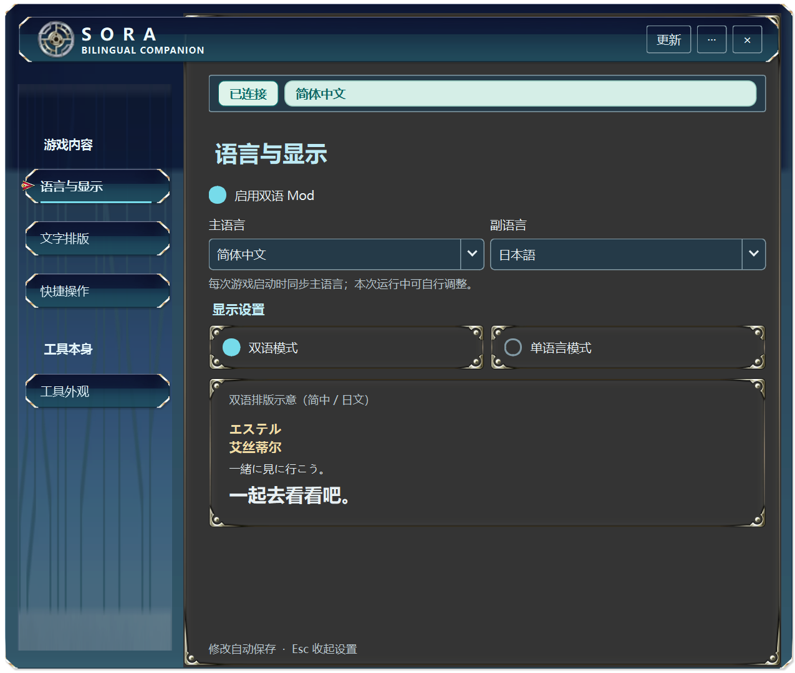

# 0.3.29 外观切换验证

新增两套外观，保留当前外观并命名为“空之轨迹（默认）”。主题仅作用于桌面窗口，不影响游戏内语言、映射、排版或性能诊断。

- 三套主题使用同一布局和绘制入口：背景、标题条、页签、卡片、更新弹层、悬浮条及缩略预览同步切换。资源来自本机游戏的 note、quest、camp、window 图集，处理记录在资产 provenance 中。
- 鼠标点击预览区域可选中整张主题卡；选中为实心圆，未选中为空心圆。自动测试核对即时生效、只选一项、重开恢复、未知值回退默认。
- 切换前后 `native-control.json` 字节不变；界面页签、70% 背景透明度和两处更新红点保留。仅将选择写入窗口偏好 INI，不调用游戏连接或映射刷新。
- 三种界面语言、三套主题、四个页面逐一检查；780 / 1000 逻辑像素宽度和 17 / 13 像素字号无横向溢出。沿用上一版菜单边界检查。
- Windows 原生 Qt 预览覆盖全部 36 个页面组合，以及三套更新弹层和悬浮条；临时配置、合成连接状态，不读取或改变玩家游戏。实际截图见下方。
- 深色主题核对字段、正文、辅助说明和选中指示的对比度；下拉箭头随控件前景色变化。共享原图缓存最多 32 张，当前 17 张；背景资源在构建时缩小，不增加游戏运行线程或逐帧解码。
- 本机完整回归通过：467 个 Python 测试（5 个按环境跳过）、162 个 JavaScript 测试及隐藏原生宿主检查。正式便携包/安装器检查见此版本 CI。游戏内卡顿问题不属于本次修复，也不宣称已解决。

