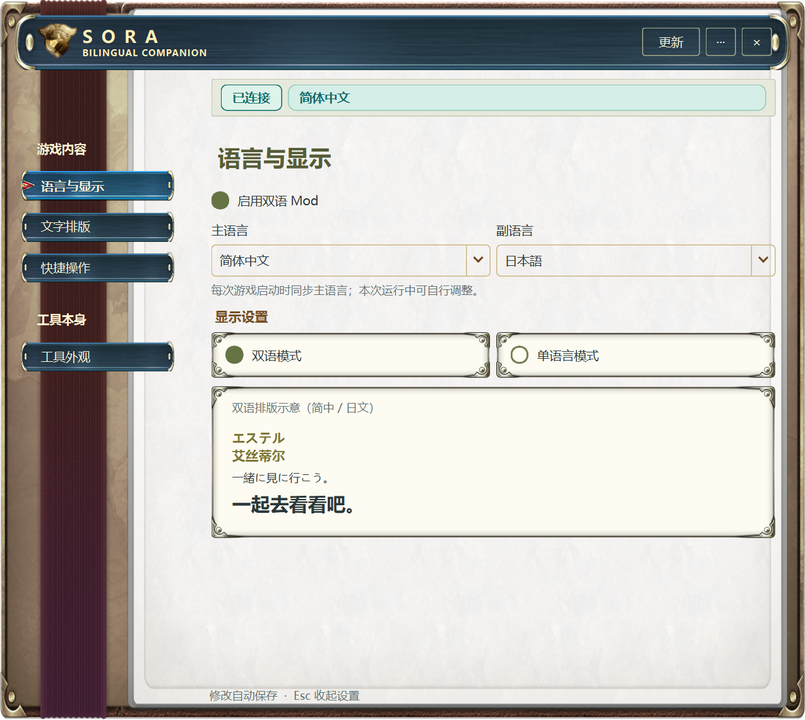

# 0.3.27 手册界面验证

本次只改变桌面 UI、更新提醒和界面生命周期，不修改游戏渲染或映射。原先的游戏内卡顿问题仍待现场证据。

## 代码与 Windows 窗口

- `python -m tools.dev check`：462 个 Python 测试（5 个平台/环境条件跳过）、162 个 JavaScript 测试通过；隐藏原生宿主检查全部通过。未连接用户游戏。
- `tests/test_handbook.py`：更新状态同时驱动标题栏/齿轮红点；查看面板不清除提醒；Esc 只关闭更新弹层；窗口关闭、最小化均不调用停用流程，托盘退出才调用停用；配置字节不变。
- 更新后的既有 UI 回归：三语切换、配置/快捷键保留、滚轮保护、导航与滚动、点击/拖拽阈值、背景透明度及恢复。
- `tests/render_handbook_preview.py --native`：真实 Windows Qt 窗口中核对中/英/日各四页，原版资源渲染、模式卡片尺寸、更新弹层、双红点及透明度；通过 Win32 `IsWindowVisible` 确认隐藏与托盘恢复。使用临时配置与合成连接状态，未读取或改变游戏进程。截图位于本地 `generated/handbook-preview/`。
- 三语页面无横向溢出。大字/较窄可用宽度时模式卡片纵向排列；额外检查其控件实际高度，避免自适应布局分配零高度。

## 分发兼容

- 七张原版切片使用 Qt RCC 编译成 Python 资源模块，素材来源与坐标/哈希保留在源码资产目录。资源随 UI 更新，无运行时解包/游戏扫描。
- 使用本机已安装 0.3.26 的 `package_contents` 验证新 0.3.27 包通过，避免旧更新器拒绝新增 PNG 路径。
- 便携 EXE 检查覆盖无系统 Python 启动、Unicode 路径、单实例、界面重载、中断更新恢复及加载 DLL 时程序更新；游戏不参与此测试。
- 安装器、CI 与正式发布结果以对应 0.3.27 发布流水线和安装回执为准。

