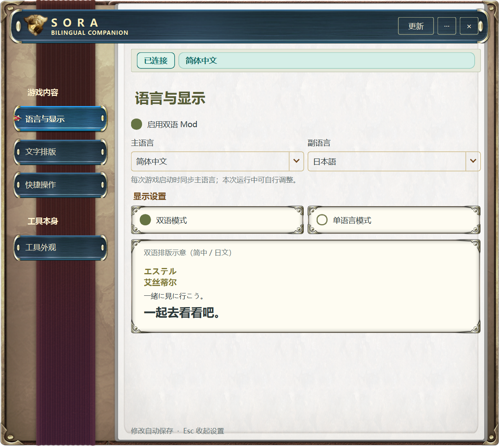

# 0.3.28 左侧目录边界验证

0.3.27 把整张背景按窗口比例拉伸，左侧目录却使用固定宽度，因此标签会越过皮革与纸张之间的边框。0.3.28 按背景原图的纸张起点分片，使用与目录共用的逻辑尺寸绘制边界。长标题的高度测量与绘制共用 QTextLayout，不裁掉名称。

- 自动回归覆盖中、英、日三种语言，780 / 850 / 1000 逻辑像素窗口宽度，13 / 17 像素字体。根据实际背景像素查找纸张边界，验证目录与纸张之间留有间距。
- 逐个点击四个页签，验证页面切换、标题全部字符进入布局、每行文字不越界、垂直高度足够、内容页无横向滚动。
- Windows 原生 Qt 窗口截图覆盖三语四页，并补充窄窗口大字体及宽窗口。视觉核对确认分组标题、蓝色选择条、箭头都在左侧区域内。
- 窗口关闭/隐藏/托盘恢复、双更新红点、更新弹层、配置保持沿用既有回归。预览使用临时配置与合成连接状态，不连接用户游戏。
- `python -m tools.dev check` 通过：463 个 Python 测试（5 个按环境跳过）、162 个 JavaScript 测试及隐藏原生宿主检查。正式分发另由发布流水线检查便携 EXE 和安装器。

